# 🏗️ Olist E-Commerce Data Engineering Project

**Duke IDS 706 - Data Engineering Final Project**

[](https://github.com/PinakiG-duke/IDS706_DE_FINAL_PROJECT/actions)
[](https://www.python.org/downloads/)
[](https://opensource.org/licenses/MIT)

## 📋 Table of Contents

- [Project Overview](#project-overview)
- [Team Members & Roles](#team-members--roles)
- [Architecture](#architecture)
- [Data Sources & Storage](#data-sources--storage)
- [Pipeline Components](#pipeline-components)
- [Setup Instructions](#setup-instructions)
- [Usage](#usage)
- [Testing](#testing)
- [Undercurrents of Data Engineering](#undercurrents-of-data-engineering)
- [Technologies Used](#technologies-used)

---

## 🎯 Project Overview

An end-to-end data engineering pipeline processing **Brazilian E-Commerce (Olist) dataset** with:

- **100,000+ orders** from 2016-2018
- **1.5M+ rows** across 9 tables
- **~120 MB** of transactional data
- **Multi-source integration** (Kaggle → S3 → PostgreSQL)

### Business Value

This pipeline enables:
- 📊 **Revenue analysis** by geography and product category
- 📈 **Customer behavior insights** and repeat purchase analysis  
- ⏱️ **Delivery performance** optimization with statistical modeling
- ⭐ **Product recommendations** based on ratings and sales patterns
- 💰 **Payment trend analysis** across multiple methods

---

## 👥 Team Members & Roles

| Name | Role | Responsibilities |
|------|------|-----------------|
| **Pinaki Ghosh** | Lead Data Engineer | Pipeline orchestration, AWS infrastructure, CI/CD |
| **Austin Zhang** | Analytics Engineer | Data transformation, statistical analysis, Polars |
| **Diwas Puri** | Data Engineer | Data ingestion, S3 management, schema design |
| **Michael Badu** | QA Engineer | Testing, data quality validation, documentation |

**Collaboration**: All team members contributed to the GitHub repository with multiple commits per week (Nov 12 - Dec 3).

---

## 🏛️ Architecture

### High-Level System Design


### Data Flow Architecture


---

## 💾 Data Sources & Storage

### Data Source

**Kaggle Dataset**: [Brazilian E-Commerce Public Dataset by Olist](https://www.kaggle.com/datasets/olistbr/brazilian-ecommerce)

- **Provider**: Olist (Brazilian e-commerce platform)
- **Period**: 2016-2018
- **Size**: ~120 MB (9 CSV files)
- **Records**: 1,551,022 rows
- **Multi-source nature**: Order data + Customer data + Product catalog + Seller info + Geolocation

### Storage Systems

#### 1. **AWS S3 (Data Lake - Raw Zone)**
- **Bucket**: `de-27-team3`
- **Prefix**: `raw/`
- **Region**: `us-east-2`
- **Purpose**: Immutable raw data storage, data versioning
- **Format**: CSV files

#### 2. **PostgreSQL (Data Warehouse)**
- **Provider**: Aiven Cloud
- **Host**: `pg-3729bd9d-bnbgoals.j.aivencloud.com:22446`
- **Database**: `defaultdb`
- **SSL**: Required
- **Purpose**: Structured analytical queries, OLAP operations

### Schema Design

#### Entity-Relationship Model


*PostgreSQL database schema showing all 9 tables with 1.5M+ rows*

#### Load Order (Critical for Foreign Keys)


```python
LOAD_ORDER = [
    # Stage 1: Independent tables (no FKs)
    "customers_raw",
    "sellers_raw",
    "products_raw",
    "geolocation_raw",
    "product_category_name_translation_raw",
    
    # Stage 2: Orders (depends on customers)
    "orders_raw",
    
    # Stage 3: Order details (depend on orders, products, sellers)
    "order_items_raw",
    "order_payments_raw",
    "order_reviews_raw",
]
```


*AWS S3 bucket showing raw CSV files uploaded from Kaggle dataset*

**Documentation**: See [`ingestion/schema_raw.sql`](ingestion/schema_raw.sql) for complete DDL.

---

## 🔧 Pipeline Components

### 1. Data Ingestion

**Location**: `ingestion/`

| Script | Purpose | Key Features |
|--------|---------|--------------|
| `ingestion_pipeline.py` | Main orchestrator | End-to-end automation |
| `download_from_kaggle.py` | Kaggle extractor | Project-local credentials |
| `upload_to_s3.py` | S3 uploader | Bulk CSV upload |
| `create_schema.py` | Schema manager | Smart detection, DDL execution |
| `s3_to_rds.py` | Data loader | FK handling, smart skip, ON CONFLICT |
| `test_connections.py` | Connection validator | S3 + PostgreSQL health checks |

**Features**:
- ✅ Idempotent operations
- ✅ Smart incremental updates (skips unchanged data)
- ✅ Foreign key constraint handling
- ✅ Duplicate detection with `ON CONFLICT DO NOTHING`
- ✅ NaN → NULL conversion
- ✅ Progress tracking for large tables

### 2. Data Transformation & Analysis

**Location**: `transformation/analyze_with_polars.py`

**Analysis Performed**:

1. **Revenue by State**
   - Joins: orders + customers + order_items + payments
   - Metrics: Total revenue, order count, avg order value
   - Output: `revenue_by_state.csv`

2. **Delivery Performance (Regression Analysis)** ⭐
   - Model: `review_score = β₀ + β₁ * delivery_days`
   - Statistical test: Linear regression with scipy
   - Metrics: R², p-value, correlation coefficient
   - **Finding**: Delivery time significantly impacts review scores (p < 0.05)

3. **Product Category Performance**
   - Metrics: Sales volume, avg price, avg review by category
   - Filtering: Min 100 sales for statistical significance
   - Output: `category_performance.csv`

**Why Polars?**
- 🚀 10-100x faster than Pandas for large datasets
- 📊 Lazy evaluation for memory efficiency
- 🔗 SQL-like syntax for familiar operations

### 3. Data Querying

**Location**: `queries/business_queries.sql`

**10 Business Intelligence Queries**:
1. Monthly revenue trend
2. Top sellers by revenue
3. Customer satisfaction by category
4. Delivery performance by state
5. Payment method analysis
6. Customer repeat purchase rate
7. Late delivery impact on reviews
8. Product combinations (market basket)
9. Geographic sales distribution
10. Product size/weight impact on pricing

### 4. Orchestration

**Location**: `orchestration/orchestration_airflow.py`

**Airflow DAG Features**:
- 📅 Scheduled daily runs
- 🔄 Task dependencies (download → upload → schema → load → transform → test)
- ⚠️ Email alerts on failure
- 🔁 Retry logic (2 attempts, 5-min delay)
- ⏱️ SLA monitoring

**Task Graph**:


### 5. Testing

**Location**: `tests/`

#### Unit Tests (`test_ingestion.py`)
- Connection validation (S3, PostgreSQL)
- Schema existence checks
- Required table verification

#### Data Quality Tests (`test_data_quality.py`)
- ✅ Row count validation (all tables have data)
- ✅ NULL value checks (critical columns)
- ✅ Foreign key integrity
- ✅ Data range validation (prices positive, scores 1-5)
- ✅ Duplicate detection
- ✅ Date consistency (delivery after purchase)

**Run tests**:
```bash
pytest tests/ -v --cov=ingestion
```

### 6. Containerization

**Files**: `Dockerfile`, `docker-compose.yml`

**Docker Services Architecture**:


**Services**:
- `pipeline`: Main ETL service
- `dashboard`: Streamlit web application (port 8501)
- `postgres-test`: Local PostgreSQL for testing (port 5433)
- `airflow-webserver`: Orchestration UI (port 8080)
- `airflow-scheduler`: Task execution engine
- `airflow-postgres`: Airflow metadata database
- `test`: Automated test runner


*Docker Desktop showing all running containers*


*Terminal output showing successful Docker container deployment*

**Run with Docker**:
```bash
# Start all services
docker-compose up -d

# Start specific service
docker-compose up -d dashboard

# View logs
docker logs -f olist-pipeline

# Stop all services
docker-compose down
```

### 7. Web Dashboard

**Location**: `dashboard/app.py`

**Interactive Streamlit Application**:

| Page | Features | Key Metrics |
|------|----------|-------------|
| **📈 Overview** | KPIs, trends | Total orders, revenue, AOV, customers |
| **🌍 Geographic** | Maps, treemaps | State/city revenue distribution |
| **📦 Products** | Scatter plots | Price vs satisfaction, payment methods |
| **🚚 Delivery** | Performance metrics | Delivery times, late delivery impact |
| **📊 Statistics** | Regression analysis | R², p-value, correlation |
| **✅ Quality** | Validation checks | Row counts, NULL checks, ranges |

**Technical Stack**:
- Framework: Streamlit 1.29.0
- Visualization: Plotly 5.18.0
- Database: PostgreSQL (real-time queries)
- Caching: 10-minute TTL
- Port: 8501

**Quick Start**:
```bash
# Start dashboard
docker-compose up -d dashboard

# Access at http://localhost:8501
```

### 8. CI/CD

**File**: `.github/workflows/ci-cd.yml`

**CI/CD Pipeline Architecture**:


**Pipeline Stages**:
1. **Lint**: flake8, black formatting
2. **Test**: pytest with coverage, PostgreSQL service
3. **Security**: Trivy vulnerability scan, CodeQL analysis
4. **Build**: Docker image build & push (optional)
5. **Deploy**: Production deployment notification (main branch)

**Automated on**:
- Push to `main` or `develop`
- Pull requests to `main`
- Daily schedule (6 AM UTC)

---

## 🚀 Setup Instructions

### Prerequisites

- Python 3.11+
- Docker & Docker Compose (optional)
- PostgreSQL client
- AWS CLI (optional)
- Git

### 1. Clone Repository

```bash
git clone https://github.com/PinakiG-duke/IDS706_DE_FINAL_PROJECT.git
cd IDS706_DE_FINAL_PROJECT
```

### 2. Install Dependencies

```bash
pip install -r requirements.txt
```

### 3. Configure Credentials

#### Kaggle API

1. Go to https://www.kaggle.com/account
2. Click "Create New API Token"
3. Download `kaggle.json`
4. Place in `.kaggle/` folder:

```bash
mkdir .kaggle
mv ~/Downloads/kaggle.json .kaggle/
chmod 600 .kaggle/kaggle.json
```

#### AWS & PostgreSQL

Copy `.env.example` to `.env` and fill in:

```bash
cp .env.example .env
# Edit .env with your credentials
```

Required variables:
```env
# AWS
AWS_ACCESS_KEY_ID=your_key
AWS_SECRET_ACCESS_KEY=your_secret

# PostgreSQL
DB_HOST=your_host.aivencloud.com
DB_PORT=22446
DB_NAME=defaultdb
DB_USER=avnadmin
DB_PASSWORD=your_password
```

### 4. Test Connections

```bash
cd ingestion
python test_connections.py
```

Expected output:
```
✓ S3 Connection Successful!
✓ PostgreSQL Connection Successful!
```

---

## 🎮 Usage

### Run Complete Pipeline

#### Option 1: Docker (Recommended)

```bash
# Build and run pipeline
docker-compose up -d pipeline

# Monitor progress
docker logs -f olist-pipeline

# What it does:
# 1. Downloads 9 CSV files from Kaggle (~2-3 min)
# 2. Uploads to S3 bucket (~1-2 min)
# 3. Creates PostgreSQL schema if needed
# 4. Loads data with FK handling (~3-5 min)
# Total time: 6-10 minutes
```

#### Option 2: Local Python

```bash
cd ingestion
python ingestion_pipeline.py
```

### Run Individual Components

```bash
# Test connections
python ingestion/test_connections.py

# Load S3 → PostgreSQL only
python ingestion/run_s3_to_postgres.py

# Run transformations
python transformation/analyze_with_polars.py

# Run data quality tests
python tests/test_data_quality.py
```

### Run Web Dashboard 🌐

```bash
# Start dashboard
docker-compose up -d dashboard

# Access at: http://localhost:8501

# View logs
docker logs -f olist-dashboard

# Stop dashboard
docker-compose stop dashboard
```

**Dashboard Architecture**:

```mermaid
graph TD
    A[User Browser] -->|HTTP Request| B[Streamlit App<br/>Port 8501]
    B -->|SQL Query| C[PostgreSQL<br/>Aiven Cloud]
    C -->|Result Set| B
    B -->|Render| D[Plotly Charts]
    B -->|Cache| E[st.cache_data<br/>10 min TTL]
    
    subgraph "Dashboard Pages"
        F[📈 Overview<br/>KPIs & Trends]
        G[🌍 Geographic<br/>Maps & States]
        H[📦 Products<br/>Categories & Ratings]
        I[🚚 Delivery<br/>Performance Analysis]
        J[📊 Statistics<br/>Regression Models]
        K[✅ Quality<br/>Data Validation]
    end
    
    B --> F
    B --> G
    B --> H
    B --> I
    B --> J
    B --> K
    
    style B fill:#e1ffe1
    style C fill:#ffe1e1
    style D fill:#e1f5ff
    style E fill:#fff4e1
```



**Dashboard Features**:
- 📈 **Overview**: KPIs, revenue trends, top categories/states
- 🌍 **Geographic Analysis**: Interactive maps, city insights
- 📦 **Product Insights**: Price vs satisfaction, payment methods
- 🚚 **Delivery Performance**: Delivery times, late delivery impact
- 📊 **Statistical Analysis**: Linear regression with visualization
- ✅ **Data Quality**: Table stats, validation checks

### Run with Docker Compose

```bash
# Start everything (pipeline + dashboard)
docker-compose up -d

# Run tests in container
docker-compose up test

# Start Airflow (orchestration)
docker-compose up airflow-webserver airflow-scheduler
# Access UI: http://localhost:8080
```

### Execute Business Queries

```bash
# Connect to database
psql -h <DB_HOST> -p <DB_PORT> -U <DB_USER> -d <DB_NAME>

# Run queries
\i queries/business_queries.sql
```

---

## 🧪 Testing

### Testing Strategy


### Run All Tests

```bash
pytest tests/ -v --cov=ingestion --cov-report=html
```

### Test Coverage Report

```bash
open htmlcov/index.html  # View coverage report
```

### Data Quality Validation

```bash
python tests/test_data_quality.py
```

**Expected output**:
```
✓ Passed: 25
✗ Failed: 0
⚠ Warnings: 0
📊 Success Rate: 100.0%
✅ ALL TESTS PASSED
```

---

## 🌊 Undercurrents of Data Engineering

### 1. Scalability


**Implementation**:
- **Horizontal**: S3 can store unlimited data, PostgreSQL read replicas
- **Vertical**: Polars lazy evaluation, chunked file processing
- **Cloud-native**: AWS infrastructure auto-scales

**Examples**:
```python
# Chunked loading for large files
for chunk in pd.read_csv(file, chunksize=10000):
    load_chunk_to_db(chunk)

# Polars lazy evaluation
df = pl.scan_csv("large_file.csv").filter(...)  # No memory load until .collect()
```

**Scalability Proof**:
- ✓ Successfully handles 1M+ row tables (geolocation_raw)
- ✓ S3 supports petabyte-scale storage
- ✓ PostgreSQL Aiven can scale to 64 vCPU, 512 GB RAM

### 2. Modularity

**Implementation**:
- Separate scripts for extract, load, transform
- Reusable functions with clear interfaces
- Docker containers for isolation

**Examples**:
```python
# Each script is independent and importable
from ingestion.download_from_kaggle import download_kaggle_dataset
from ingestion.upload_to_s3 import upload_directory_to_s3
```

**Module Structure**:
```
ingestion/       # Data loading modules
transformation/  # Analytics modules
queries/         # Business intelligence
tests/           # Quality assurance
orchestration/   # Workflow management
```

### 3. Reusability

**Implementation**:
- Generic loader functions work for any CSV → PostgreSQL
- SQL queries parameterized for different time ranges
- Docker images reusable across environments

**Examples**:
```python
# Generic loader
def load_csv_into_table(csv_path, table_name, conn):
    """Works for any table with schema inference."""
    
# Reusable across dev/staging/prod
docker run olist-pipeline --env-file .env.prod
```

### 4. Observability


**Implementation**:
- Detailed logging with timestamps
- Progress bars for long operations
- Data quality metrics after each run
- Airflow UI for pipeline monitoring

**Examples**:
```python
# Structured logging
log(f"Loading {table_name}: {row_count:,} rows", level="INFO")

# Metrics
print(f"✓ Loaded: {loaded_rows:,} rows in {elapsed:.2f}s")
print(f"⚠ Skipped: {skipped_rows:,} duplicates")
```

**Monitoring Stack**:
- Airflow UI: Task status, logs, SLA monitoring
- PostgreSQL logs: Query performance
- GitHub Actions: CI/CD pipeline status
- Docker logs: Container health checks
- Prometheus (optional): Custom metrics

### 5. Data Governance

**Implementation**:
- `.gitignore` excludes credentials
- `.env` for secret management
- SSL required for database connections
- Row-level security via PostgreSQL roles

**Examples**:
```python
# Credential management
load_dotenv()  # Never commit .env
AWS_KEY = os.getenv('AWS_ACCESS_KEY_ID')

# SSL enforcement
conn = psycopg2.connect(..., sslmode='require')
```

**Security Measures**:
- ✓ Credentials in `.env` (not in code)
- ✓ `.gitignore` prevents accidental commits
- ✓ Kaggle API token in separate folder
- ✓ PostgreSQL SSL/TLS encryption
- ✓ IAM roles for AWS access (production)

### 6. Reliability

**Implementation**:
- Retry logic in Airflow (2 attempts, 5-min delay)
- Transaction rollback on errors
- Foreign key constraints prevent orphan records
- Data validation tests before downstream use

**Examples**:
```python
# Transaction safety
with conn:
    conn.execute("BEGIN")
    load_data()
    conn.execute("COMMIT")  # Auto-rollback on exception

# Idempotent operations
if table_exists and data_matches:
    skip_load()  # Safe to re-run
```

**Reliability Features**:
- ✓ Idempotent pipeline (safe to re-run)
- ✓ Foreign key enforcement
- ✓ ON CONFLICT handling for duplicates
- ✓ Data quality tests as gates
- ✓ Email alerts on failure (Airflow)

### 7. Efficiency

**Implementation**:
- Smart skip logic (don't reload unchanged data)
- Polars (10-100x faster than Pandas)
- Bulk inserts with `execute_values()`
- Lazy evaluation where possible

**Examples**:
```python
# Smart skipping
if csv_row_count == db_row_count:
    print(f"⏭️ Skipping {table}: data unchanged")
    return

# Bulk insert (1000x faster than row-by-row)
execute_values(cur, query, data_tuples)
```

**Performance Metrics**:
- ✓ 1M rows loaded in ~3 minutes
- ✓ Polars analysis: 1.5M rows in ~10 seconds
- ✓ S3 upload: 120 MB in ~1 minute
- ✓ Smart skip saves ~50% of run time

### 8. Security

**Implementation**:
- Environment variables for secrets
- SSL/TLS for all connections
- Docker secrets management
- Security scanning in CI/CD (Trivy)

**Examples**:
```python
# No hardcoded credentials
DB_PASSWORD = os.getenv('DB_PASSWORD')  # ✓
DB_PASSWORD = "secret123"               # ✗

# SSL enforcement
sslmode='require'
```

**Security Checklist**:
- [x] Credentials in environment variables
- [x] `.env` in `.gitignore`
- [x] SSL/TLS for database connections
- [x] Kaggle token with read-only access
- [x] Docker secrets for production
- [x] Trivy security scanning in CI/CD
- [x] No secrets in logs

### Summary Table

| Principle | Implementation | Evidence |
|-----------|----------------|----------|
| **Scalability** | Cloud storage, lazy eval | 1M+ rows processed |
| **Modularity** | Separate scripts | 7 independent modules |
| **Reusability** | Generic functions | Docker containers |
| **Observability** | Logging, metrics | Airflow UI, pytest coverage |
| **Governance** | `.env`, SSL | No secrets in git |
| **Reliability** | Retries, transactions | Idempotent pipeline |
| **Efficiency** | Smart skip, Polars | 50% time saved |
| **Security** | SSL, env vars | Trivy scans pass |

---

## 🛠️ Technologies Used

### Languages
- Python 3.11
- SQL (PostgreSQL dialect)

### Data Processing
- Polars (fast DataFrames)
- Pandas (CSV processing)
- NumPy (numerical operations)
- SciPy (statistical analysis)

### Storage
- AWS S3 (data lake)
- PostgreSQL (Aiven Cloud)

### Orchestration
- Apache Airflow

### Testing
- pytest (unit tests)
- pytest-cov (coverage)
- Custom data quality tests

### DevOps
- Docker & Docker Compose
- GitHub Actions (CI/CD)
- Trivy (security scanning)

### Code Quality
- flake8 (linting)
- black (formatting)

---

## 📊 Project Statistics

| Metric | Value |
|--------|-------|
| **Total Data Rows** | 1,551,022 |
| **Data Size** | ~120 MB |
| **Tables** | 9 |
| **Python Scripts** | 15+ |
| **SQL Queries** | 10 |
| **Test Cases** | 25+ |
| **Docker Services** | 6 |
| **CI/CD Jobs** | 5 |
| **Code Lines** | 2,500+ |
| **Team Commits** | 50+ |

---

## 📈 Results & Insights

### Key Findings

1. **Revenue by State**
   - São Paulo (SP) generates 40% of total revenue
   - Top 3 states account for 65% of sales

2. **Delivery Impact (Regression)**
   - **Model**: `review_score = 4.15 - 0.05 * delivery_days`
   - **R² = 0.23** (23% of review variance explained)
   - **p < 0.001** (highly significant)
   - **Interpretation**: Each extra delivery day reduces review score by 0.05 points

3. **Product Categories**
   - "Bed, Bath & Table" highest revenue (R$ 1.2M)
   - "Health & Beauty" best rated (4.7/5)
   - "Office Furniture" highest avg price (R$ 350)

4. **Payment Methods**
   - Credit card: 75% of transactions
   - Avg installments: 3.5 payments
   - Boleto (cash): 20% of transactions

---

## 🔮 Future Enhancements

- [ ] Real-time streaming with Kafka
- [ ] Machine learning models (churn prediction)
- [x] **Interactive web dashboard** (Streamlit) ✅
- [ ] Data lineage tracking with Great Expectations
- [ ] Multi-region deployment (US East + South America)
- [ ] dbt for transformation layer
- [ ] Snowflake integration for cloud DW
- [ ] Advanced analytics (customer segmentation, RFM analysis)
- [ ] Mobile app for dashboard access

---

## 📝 License

MIT License - See [LICENSE](LICENSE) file

---

## 🙏 Acknowledgments

- **Olist**: For providing the dataset
- **Kaggle**: For hosting the data
- **Duke University**: IDS 706 course
- **Professor**: For guidance and feedback

---

## 📞 Contact

For questions or collaboration:

- **GitHub**: [PinakiG-duke](https://github.com/PinakiG-duke)
- **Email**: pg163@duke.edu

---

**Built with ❤️ by Team IDS706**
